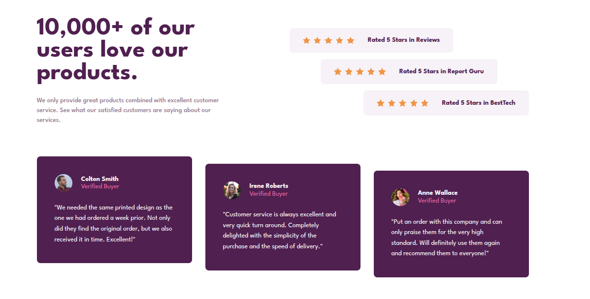

# Frontend Mentor - Social proof section solution

This is a solution to the [Social proof section challenge on Frontend Mentor](https://www.frontendmentor.io/challenges/social-proof-section-6e0qTv_bA). Frontend Mentor challenges help you improve your coding skills by building realistic projects.

## Table of contents

- [Overview](#overview)
  - [The challenge](#the-challenge)
  - [Screenshot](#screenshot)
  - [Links](#links)
- [My process](#my-process)
  - [Built with](#built-with)
  - [What I learned](#what-i-learned)
  - [Continued development](#continued-development)
  - [Useful resources](#useful-resources)
- [Author](#author)

## Overview

### The challenge

Users should be able to:

- View the optimal layout for the section depending on their device's screen size

### Screenshot



### Links

- Solution URL: [Add solution URL here](https://www.frontendmentor.io/solutions/trustbootsection-VMN4HFpi4e)
- Live Site URL: [Add live site URL here](https://freedev-group.github.io/Social-proof-section-Kabidu/)

## My process

### Built with

- Semantic HTML5 markup
- CSS custom properties
- Flexbox
- CSS Grid
- Mobile-first workflow

### What I learned

In this project, I learned how to create a responsive social proof section using modern CSS techniques. I gained experience with Flexbox for arranging the top section and CSS Grid for the testimonials layout. I also practiced using CSS custom properties for consistent theming and background images for visual appeal.

Here's a code snippet I'm proud of:

```css
.ratings {
  display: flex;
  flex-direction: column;
  gap: 15px;
  width: 540px;
}

.rating-card {
  background-color: var(--light-grayish-magenta);
  padding: 20px 30px;
  border-radius: 8px;
  display: flex;
  align-items: center;
  gap: 30px;
}
```

This helped me understand how to create reusable card components with consistent styling.

### Continued development

I want to continue focusing on improving my CSS skills, particularly with advanced layout techniques like Grid and Flexbox. I'd also like to learn more about accessibility best practices and how to make websites more inclusive. In future projects, I plan to incorporate JavaScript for interactivity and explore frameworks like React.

### Useful resources

- [Frontend Mentor](https://www.frontendmentor.io/) - Provided the challenge and design files.
- [MDN Web Docs](https://developer.mozilla.org/en-US/docs/Web/CSS) - Great resource for CSS properties and Flexbox/Grid explanations.
- [CSS-Tricks](https://css-tricks.com/) - Helpful articles on CSS layouts and responsive design.


## Author
- Code by Kabidu Munguakonkwa Sage
- Frontend Mentor - [@Abidusage](https://www.frontendmentor.io/profile/Abidusage)

